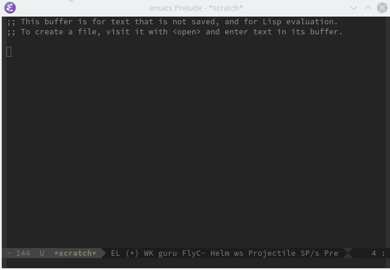

# Zone Matrix Wake Up



I can't believe it has been 20 years already since the release of the Matrix. So for the 20 year anniversary I created the famous wake up scene as a zone program for Emacs (an Emacs screen saver). (And In an attempt to wake up more people from the Matrix...)

[](http://www.youtube.com/watch?v=Smwrw4sNCxE)

## Install
Save the file *zone-matrix-wak-up.el* to a directory and add it to you `load-path` in your emacs init file:

    (add-to-list 'load-path "~/.emacs.d/zone-matrix-wake-up")

Require the package:

    (require 'zone-matrix-wake-up)

## Usage

You can add it to the list of zone programs or just overwrite the list to have only `zone-pgm-matrix-wake-up`.
``` emacs-lisp
    (setq zone-programs [zone-pgm-matrix-wake-up])
```

Specify after how many seconds of non-activiy to zone out:
``` emacs-lisp
    (zone-when-idle 120)
```

You can also run it as a preview directly by invoking:
``` emacs-lisp
    (zone-matrix-wake-up)
```
## Contributing
Welcome to report an issue on the issue tracker if you you find any bugs or have suggestions/ideas. Patches are welcome. Just create fork, work on a separate branch and open a pull request.
